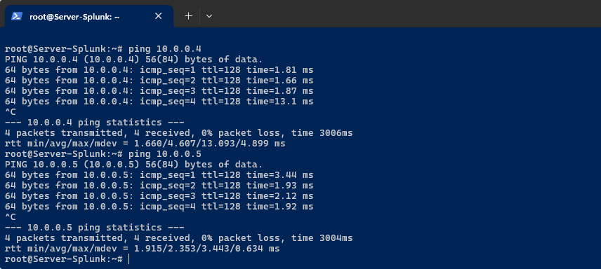
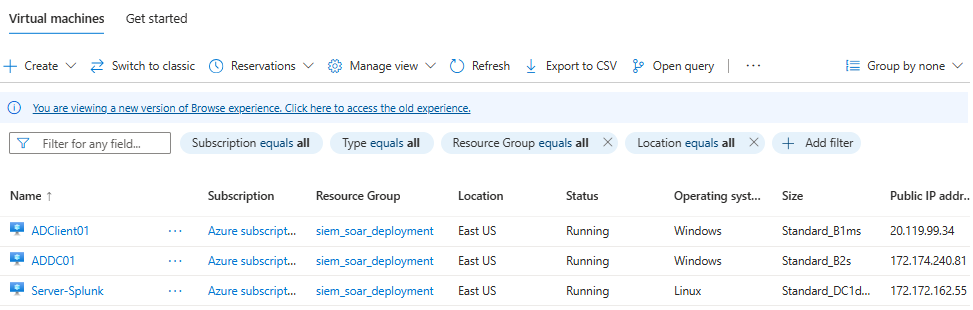
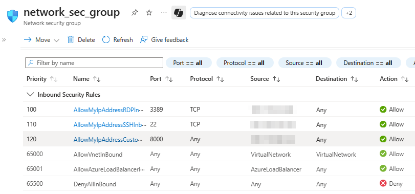

# Part 2 - Cloud Infrastructure Setup (Vultr)

## 🎯 Objective
Deploy the required virtual machines on Azure to host the Active Directory server, Splunk SIEM, and Shuffle SOAR platform.

This step demonstrates **hands-on experience with cloud-based infrastructure deployment**, including firewall configuration and VM provisioning, relevant for SOC environments running in hybrid or cloud setups.

## 🛠️ Main Steps
### 1. Created the following virtual machines on Azure:
   - Windows Server (for Active Directory).
   - Windows Server (test machine).
   - Ubuntu Server (for Splunk SIEM).
   
     Since we're working on Azure, creating different servers is done from "`Create a resource`" menu. Below you can see the deployment panel used to create each server.
     
     

     Determining resource sizing when creating virtual servers requires reasoned and sound judgment. For this implementation, the sizing of each server is detailed in the following table.
     
     
|              | **Name**      |          **Size** | **SO**        | **Backups** | **Logical Container** | **Network Type** | **Firewal Type** |
| :----------- | :------------ | ----------------: | ------------- | ----------- | ----------------- | ------------ | ------------ |
| AD           | ADDC01        |      Standard_B2s | Standard 2022 | no          | Resource Group    | Virtual Network  | NSG          |
| Test Machine | ADClient01    |     Standard_B1ms | Standard 2022 | no          | Resource Group    | Virtual Network  | NSG          |
| Splunk       | Server-Splunk | Standard_DC1ds_v3 | Ubuntu 22.04  | no          | Resource Group    | Virtual Network  | NSG          |

***   
### 2. Configured basic networking and firewall rules to allow necessary ports (RDP, SSH, Splunk, Shuffle).
Using the Azure "Network Security Group" resource, we configure the ports we will use in the "Inbound Security Rules" section:
- Port 22: SSH
- Port 3389: RDP
- Port 8000: Splunk

### 3. Verified connectivity between the machines (Don't forget!).

## 📷 Evidence
- Screenshot of Azure dashboard showing deployed VMs.
  
  
  
- Example of firewall rules configured Azure (Network Security Group):
  
  

## 🔗 Key Takeaways
- Understanding of basic cloud networking and VM provisioning.
- Ability to deploy SOC components in a cloud environment.

## ✅ Result
All required VMs are deployed and networked properly, ready for Active Directory and Splunk installation in the next step.
