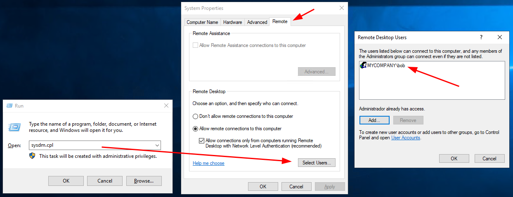
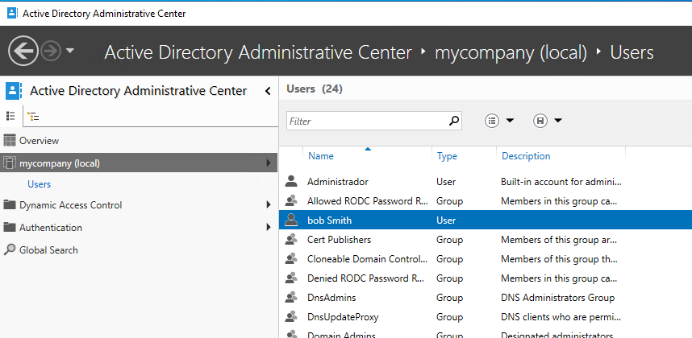
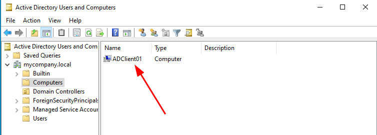
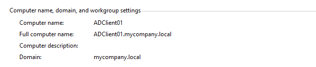

# Part 3 - Active Directory Setup

## 🎯 Objective
Install and configure Active Directory on Windows Server, promote it to a Domain Controller, and create user accounts and endpoints.

This step demonstrates **knowledge of AD administration**, which is essential for SOC analysts investigating authentication logs, privilege escalation, and lateral movement.

## 🛠️ Main Steps
### 1. Installed the Active Directory Domain Services role on Windows Server.
### 2. Promoted the server to Domain Controller.
### 3. Created test users and groups relevant to the SOC use case.
### 4. Joined a test machine to the domain.
It's important to note that in Azure, an additional step is required to connect to domain users via RDP. You must log in as the local user, and in "Remote Connections," you must register the domain user name that will be able to connect to the workstation via RDP:

## 📷 Evidence
- AD Users accounts.

  
  
- Endpoint successfully joined to the domain.

  

## 🔗 Key Takeaways
- Hands-on experience managing AD environments.
- Understanding how user accounts and machines interact in a domain context.

## ✅ Result
A functional Active Directory domain with users and endpoints, serving as the data source for Splunk log ingestion in the next phase.
