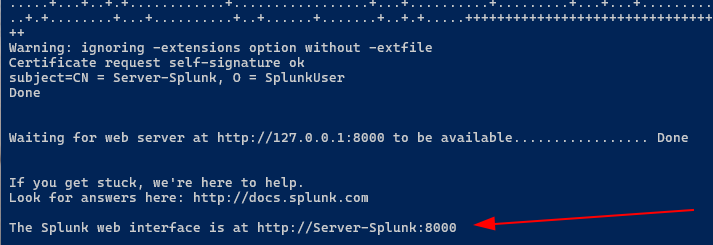
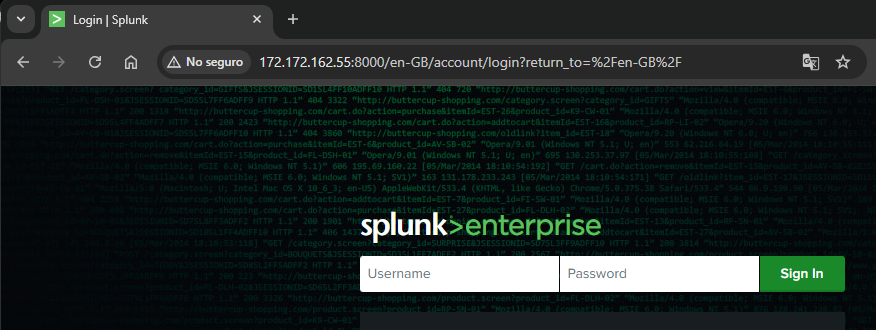
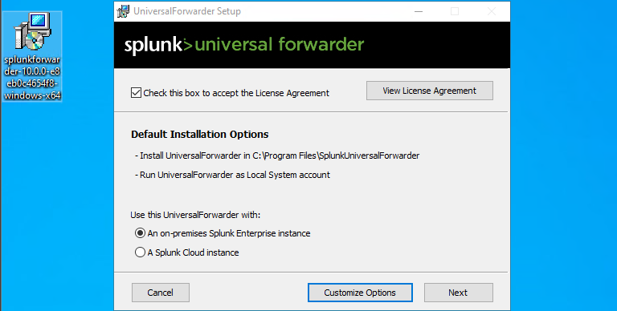
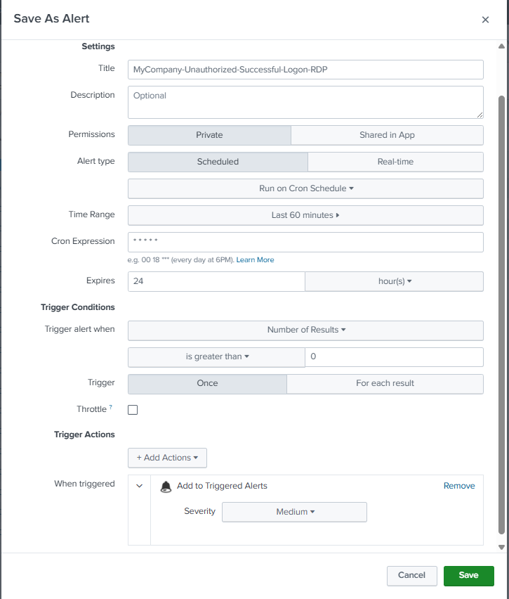
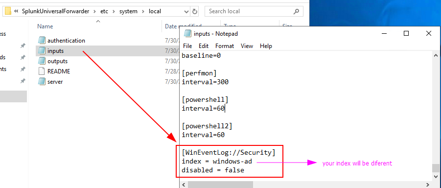
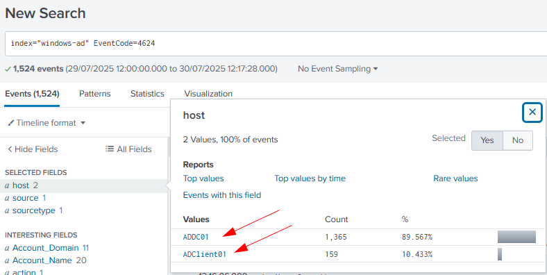
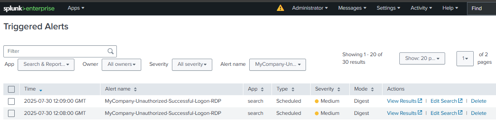

# Part 4 - Splunk Setup & Alerts

## 🎯 Objective
Deploy Splunk on Ubuntu, ingest Windows security logs from the domain controller, and create an alert to detect unauthorized successful logins.

This step demonstrates practical SIEM configuration and log analysis skills, essential for a SOC Analyst to detect suspicious authentication events in Active Directory environments.

## 🛠️ Main Steps
### 1. Installed Splunk Enterprise on Ubuntu.
  - First, we register with Splunk by going to Platform -> Products -> Free Trials & Downloads -> Splunk Enterprise and copying the link. Then we download Splunk on Ubuntu.
  - Next, we need to run the binary called "splunk", to do this we install the .deb package, then we search for and run the binary to finish the Splunk installation:
```bash
	dpkg -i <downloadfile.deb>
	cd /opt/splunk/bin
	./splunk start
```
  We observe the message after installation, this data will help us log in to Splunk in the browser.
  

  - We also need to allow port 8000 on Ubuntu: access to Splunk web console (also in Azure NGS, but at this point that has already been done)
```bash
ufw allow 8000
```
  - I now have access to Splunk from my personal laptop.
  

### ⚙️There are still some settings missing here.

1. **Set the Time Zone to GMT**    
    - Navigate to: `Administrator > Preferences`        
    - Select **GMT** as the time zone.
        
2. **Install the Splunk Add-on for Microsoft Windows**    
    - Go to **Apps > Manage Apps > Install App from File or URL**.        
    - Install **Splunk Add-on for Microsoft Windows**.        
    - Use the same credentials created on [splunk.com](https://www.splunk.com/).
        
3. **Create a New Index**    
    - Navigate to: `Settings > Indexes > New Index`.        
    - Enter any desired **Name** for the index.        
    - Click **Save**.
        
4. **Enable Data Receiving from Forwarder**    
    - Go to: `Settings > Forwarding and Receiving > Configure Receiving`.        
    - Click **New Receiving Port**.        
    - Enter port **9997** and click **Save** (don't forget the Azure Firewall).
    
### 2. Configured Universal Forwarder on Windows (ADDC01 and ADClient01) to send Security Event Logs.

- **Universal Forwarder on Windows**:
    
    - Go to Splunk website → Products → Free Trials & Downloads → Universal Forwarder: Download the appropriate version.        
    - Double-click the installer, specify Username. Do not place anything on the "Deployment Server", but put it on the "Receiving Server" (IP and Port), then click Next some times, and Install.
 
      
              
- **Edit the `inputs.conf` file:**        
        - Copy `C:/Program Files/SplunkUniversalForwarder/etc/system/default/inputs.conf` to `C:/Program Files/SplunkUniversalForwarder/etc/system/local/`
        - Edit the newly created `inputs.conf` file and add at the end:
            
            ```txt
            [WinEventLog://Security]
            index = [name of your index]
            disabled = false
            ```
            
- **Modify the "SplunkForwarder" service:**        
	- Double-click the service → Log On → select "Local System account". Apply and restart the service.
   
- **Test:** In Splunk, run a simple search to confirm event ingestion in the new index:        
```SPL
index=[index_name]
```
        
	> If no events appear, ensure port 9997 is open on the Ubuntu server.

### 3. Created a correlation search to detect unauthorized successful logins (from unauthorized networks)
Event 4627 indicates a successful login. This event has different login types; in this case, we'll focus on types 7 (unlock) and 10 (RemoteInteractive).

- The following search, although it can be optimized, gives us what we need for now:
```
index=mydfir-ad EventCode=4624 (Logon_Type=7 OR Logon_Type=10) Source_Network_Address=* Source_Network_Address!="-" Source_Network_Address!=10.*
| stats count by _time,ComputerName,Source_Network_Address,user,Logon_Type
```

- We select the "save as alert" option and choose the options shown in the image:

 

## 📷 Evidence
- **File `inputs.conf`**



- **Splunk search showing ingested Windows events.**



- **Alert rule configured in Splunk.**



## 🔗 Key Takeaways
- Understanding of SIEM log ingestion and configuration.  
- Knowledge of Windows Event Codes relevant to authentication.  
- Practical experience creating detection rules aligned with SOC use cases.

## ✅ Result
Splunk ingests authentication events from the domain controller and triggers an alert upon detecting unauthorized successful logins.  
This alert will serve as the detection source for the SOAR automation in the next phase.
